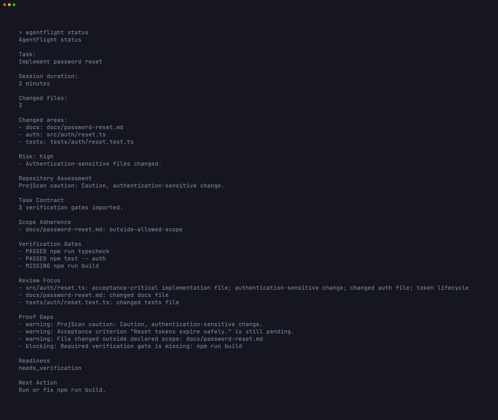
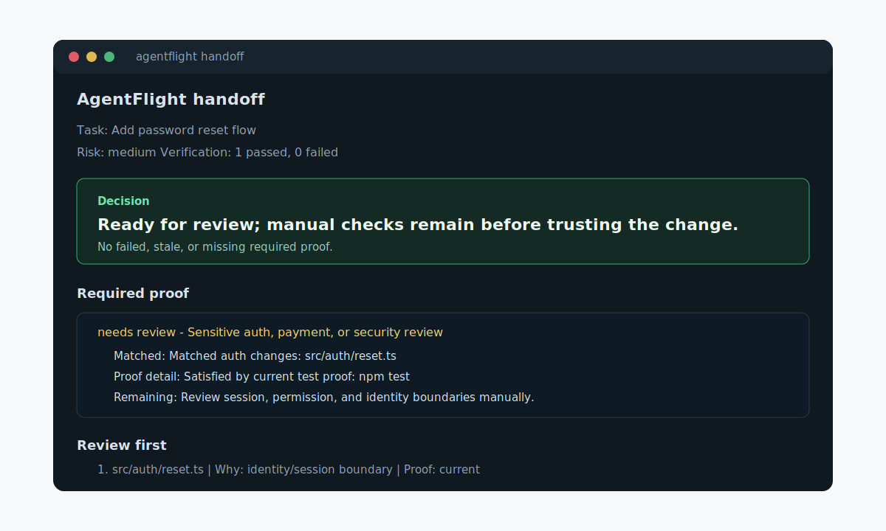

# AgentFlight

<p align="center">
  <a href="https://www.baseframelabs.com/apps/agentflight">
    
  </a>
</p>

See what changed, what proof ran, what failed, and whether the work is ready for review.

AgentFlight is a local-first review layer for coding agent sessions from Baseframe Labs. It records task, git, snapshot, and verification evidence, shows failure excerpts, and tells you whether the proof is right for this repo before you trust the result.

ProjScan finds the risk.
AgentLoopKit controls the work.
AgentFlight proves the result.

Website: [baseframelabs.com/apps/agentflight](https://www.baseframelabs.com/apps/agentflight)

Real AgentFlight Baseframe readiness capture:



AgentFlight helps you:

- start a coding agent session
- capture verification evidence
- finish a session with one Review Passport
- see changed files and risk
- read a local Review Contract with claim-by-claim proof references
- compare the change against a local Project Review Contract proof standard that explains why each rule matched
- compare current proof against similar local ready handoffs from this repo
- see the Trust Delta: failed proof, stale proof, missing proof, manual review, and repo-history guidance
- follow a review queue that puts proof reruns and manual checks in order
- see reviewer routing for maintainer, verification, security, Docs/DX, and release review paths
- record a local review receipt when a reviewer accepts the handoff
- see when an accepted handoff becomes stale after files change
- create snapshots during the session
- generate a local review handoff
- generate a Review Passport for reviewers and downstream tools
- generate a proof report and local replay timeline
- emit Baseframe Suite evidence for AgentLoopKit from local JSON contracts
- find recent local sessions and their artifacts
- create a resume prompt for the next agent or reviewer




## 60-Second Workflow

```bash
npx agentflight@latest init
npx agentflight@latest start --task "Add password reset flow"

# Run your coding agent

npx agentflight@latest verify
npx agentflight@latest snapshot --note "Initial implementation verified"
npx agentflight@latest finish
npx agentflight@latest history --limit 1
```

Baseframe Suite Integration v1 is documented in [`docs/integrations/baseframe-suite-v1.md`](docs/integrations/baseframe-suite-v1.md). Review Passport details are documented in [`docs/development/review-passport.md`](docs/development/review-passport.md).

What you get:

- `init` creates local `.agentflight/` project files and seeds detected verification commands into `.agentflight/config.json` when package scripts exist.
- `start` records the task, git branch, commit, dirty state, package manager, and tool availability.
- `verify` runs configured commands and stores stdout, stderr, exit code, timing, pass/fail status, and a source-free changed-file proof snapshot. Use `verify -- <command>` for one explicit proof command.
- `status` answers what changed, how risky it is, what proof the repo requires, why those requirements matched, what changed the trust state, who should review which path, whether proof is current or stale, which files invalidated stale proof, whether similar local ready handoffs used stronger proof, what the Review Contract claims, and what to do next.
- `snapshot --note "..."` records the current git, risk, and proof state as a timeline event.
- `finish` generates the local Review Passport plus handoff, report, replay, and resume artifacts. In Baseframe sessions, it also finalizes `agentflight-result.json`.
- `handoff` generates the local review packet: decision, readiness, required proof, proof reasons, Review Contract path, proof gaps, failed excerpts, and report/replay/resume artifact paths.
- After local review acceptance, `handoff --accept` records a local review receipt for the accepted handoff. It stores local metadata and changed-file fingerprints only, then lets later `status`, `history`, `report`, `replay`, and `resume` show whether that acceptance is current, stale, blocked, or needs changes. It is not identity, a signature, approval automation, or a PR comment.
- `report` writes a Markdown proof report with claim-to-proof references for review.
- `replay` writes a local HTML review path and timeline you can open in a browser, with links from Review Contract claims to related proof.
- `resume` writes a continuation prompt for the next safe step, including the current Review Contract state.
- `history` shows a latest action with recorded readiness, the artifact to open first, and recent local handoff/report/replay/resume paths without uploading, syncing, or switching sessions. Use `history --task <text>` or `history --state ready|blocked|needs_verification|unknown|current` to narrow existing local records.

## Local Review Flow

```text
Your coding agent / app
  (Claude Code, Cursor, Codex, LangChain, Agno, Strands, your own code...)
       | task text . changed files . verification output . snapshots
       v
  +--------------------------------------------------------------+
  | AgentFlight        (runs locally - your data stays here)     |
  | ------------------------------------------------------------ |
  | Session recorder -> Verification evidence -> Review Contract |
  |        |                    |                    |           |
  |        |                    |                    +-> claims  |
  |        |                    +-> stdout/stderr, excerpts,     |
  |        |                        proof snapshots              |
  |        +-> changed files, snapshots, timeline                |
  |                                                              |
  | Project Review Contract: repo proof standard + manual checks |
  | Repo calibration: compare proof with similar ready handoffs   |
  | Trust Delta: stale, failed, missing, manual, under-proven     |
  | Review Queue: proof reruns, manual checks, file inspection    |
  | Review Routing: who should inspect what, and why              |
  | Review Receipt: local acceptance + stale-after-change state   |
  |                                                              |
  | Handoff . Report . Replay . Resume . History                 |
  +--------------------------------------------------------------+
       | local review packet + proof references
       v
Engineer / reviewer
```

## Watch The Flow

AgentFlight turns a loose coding agent session into a local proof trail:

1. Start a session before you ask the coding agent to work.
2. Capture real verification output with `agentflight verify`.
3. Snapshot meaningful checkpoints.
4. Read `status` to see changed files, risk, required proof, Trust Delta, review queue, reviewer routing, proof freshness, repo calibration, gaps, and next action.
5. Run `finish` when you need the Review Passport and full local review packet.
6. Run `handoff --accept` after local review acceptance to record a receipt.
7. Use `history --limit 1` to reopen the latest local handoff, report, replay, or resume artifact.

The replay artifact is a self-contained local HTML file. It leads with the review verdict and a compact review path, then lays out risk, Trust Delta, review queue, reviewer routing, review receipt, review focus, required proof, why each requirement matched, what proof satisfied it, repo calibration, Review Contract claims, proof freshness, proof gaps, the session timeline, and verification evidence (with inline failure excerpts, so you can see what broke without opening a log file) as a readable flight record. Review Contract claims link to the related proof, file focus, proof gap, or verification run where possible:


A high-resolution still is also available at [`docs/assets/agentflight-replay-timeline.png`](docs/assets/agentflight-replay-timeline.png).

## Why This Exists

Coding agents move fast. After a few prompts, you can lose track of:

- what changed
- whether the agent drifted from the task
- what was verified
- what failed
- what is safe to review
- how to resume the work later

AgentFlight gives you a local control room for that work. It records the session, captures proof, shows risk, and creates handoff artifacts without uploading source code.

## Sample Outputs

These examples are abridged so the page stays readable.

`agentflight status` excerpt:

```text
AgentFlight status

Task:
Add password reset flow

Changed files:
3

Risk: medium
- Application source files changed.

Verification Evidence:
1 passed, 0 failed

Review first:
1. src/auth/reset.ts
   Proof: current
   Why: identity/session path
   Focus: Check session, permission, and identity boundaries first.

Decision:
Ready for review; manual checks remain before trusting the change.

Why:
- 1 manual-review requirement remains.
- No failed, stale, or missing required proof.

Trust delta:
- Proof exists, but similar local ready handoffs used stronger proof.
- warning - Similar local ready handoffs for auth changes usually included npm run e2e:auth.
  Files: src/auth/reset.ts
  Suggested proof: agentflight verify -- npm run e2e:auth

Review queue:
1. Consider stronger local-history proof
   Similar local ready handoffs for auth changes usually included npm run e2e:auth.
   Files: src/auth/reset.ts
   Suggested proof: agentflight verify -- npm run e2e:auth
2. Inspect src/auth/reset.ts
   Check session, permission, and identity boundaries first.
   Files: src/auth/reset.ts

Review routing:
1. Maintainer - needs review
   Start with the highest-signal changed files and trust-state summary.
   Files: src/auth/reset.ts
2. Verification - needs review
   Proof needs a rerun, missing command, or stronger local-history check.
   Suggested proof: agentflight verify -- npm run e2e:auth
3. Security - needs review
   Security-sensitive paths need focused manual inspection.
   Files: src/auth/reset.ts

Review receipt:
- No local review receipt recorded yet.

Required proof:
- needs review - Sensitive auth, payment, or security review
   Matched: Matched auth changes: src/auth/reset.ts
   Proof: current
   Proof detail: Satisfied by current test proof: npm test
   Satisfied by: test proof (npm test)
   Accepted proof: test
   Manual review: Review session, permission, identity, payment, or credential boundaries manually.
   Files: src/auth/reset.ts
   Remaining: Review session, permission, identity, payment, or credential boundaries manually.

Repo calibration:
- Similar local ready handoffs suggest 1 additional proof command for this change. Source: local session history; scanned 4, matched 2.
- under-proven - auth
   Current proof: npm test
   Historical proof: npm run e2e:auth, npm test
   Suggested proof: agentflight verify -- npm run e2e:auth
   Based on: 2 similar ready handoffs

Review Contract:
Review path: Ready for review with 3 supported claims and 1 manual-review claim.
- supported - Session task: Add password reset flow
- needs review - Required proof: Sensitive auth, payment, or security review
- supported - Changed file reviewed: src/auth/reset.ts
- supported - Review readiness: Ready for review

Proof gaps:
- none

Latest snapshot:
- Note: Initial implementation verified
- Risk: medium
- Changed files: 3

Readiness: Ready for review
Reason: Verification evidence matches the observed review risk.

Next action:
Run agentflight handoff to generate the local review packet.
```

After a reviewer accepts the local handoff, record a receipt:

```bash
npx agentflight@latest handoff --accept
```

Later status and history output will show whether the accepted handoff still
matches the current changed-file state:

```text
Review receipt:
Review receipt current
- Accepted local handoff.
- Recorded: 2026-06-24T18:42:00.000Z
- State: Accepted handoff still matches the current changed-file state.
- Next: Keep the receipt with the local handoff.
```

The receipt is a local note attached to the session. It is not identity, a
signature, approval automation, hosted review, or a PR comment.

If a file changes after acceptance, AgentFlight marks the receipt stale and adds
a review queue step to refresh the handoff after re-review.

When proof goes stale, AgentFlight names the files that invalidated it:

```text
Proof freshness:
- Verification proof is stale for auth changes after proof was captured. Rerun verification for these files. Docs changes also need manual review.
- Proof-required stale files: auth (src/auth/reset.ts)
- Manual-review stale files: docs (README.md)
```

`agentflight report`:

```text
# AgentFlight Proof Report

## Trust Delta
- Proof exists, but similar local ready handoffs used stronger proof.
- warning - Similar local ready handoffs for auth changes usually included npm run e2e:auth.
  Files: src/auth/reset.ts
  Suggested proof: agentflight verify -- npm run e2e:auth

## Review Queue
1. Consider stronger local-history proof
   Similar local ready handoffs for auth changes usually included npm run e2e:auth.
   Files: src/auth/reset.ts
   Suggested proof: agentflight verify -- npm run e2e:auth

## Review Routing
- 4 reviewer routes need attention before trust.
1. Maintainer - needs review
   Start with the highest-signal changed files and trust-state summary.
   Why: Proof exists, but similar local ready handoffs used stronger proof.
   Files: src/auth/reset.ts
2. Verification - needs review
   Proof needs a rerun, missing command, or stronger local-history check.
   Why: Similar local ready handoffs for auth changes usually included npm run e2e:auth.
   Files: src/auth/reset.ts
   Suggested proof: agentflight verify -- npm run e2e:auth
3. Security - needs review
   Security-sensitive paths need focused manual inspection.
   Why: Auth, payment, secret, database, dependency, or runtime configuration paths changed.
   Files: src/auth/reset.ts
4. Docs/DX - needs review
   User-facing docs, examples, or command/report copy changed.
   Why: Check that public wording, examples, and local-first claims remain accurate.
   Files: README.md

## Review First
1. src/auth/reset.ts
   - Proof: current
   - Why: identity/session path

## Required Proof
- needs review - Sensitive auth, payment, or security review
  - Matched: Matched auth changes: src/auth/reset.ts
  - Proof: current
  - Proof detail: Satisfied by current test proof: npm test
  - Satisfied by: test proof (npm test)
  - Accepted proof: test
  - Manual review: Review session, permission, identity, payment, or credential boundaries manually.
  - Files: src/auth/reset.ts
  - Remaining: Review session, permission, identity, payment, or credential boundaries manually.

## Repo Calibration
- Similar local ready handoffs suggest 1 additional proof command for this change. Source: local session history; scanned 4, matched 2.
- under-proven - auth
  - Current proof: npm test
  - Historical proof: npm run e2e:auth, npm test
  - Suggested proof: agentflight verify -- npm run e2e:auth
  - Based on: 2 similar ready handoffs

## Review Contract
Review path: Ready for review with 3 supported claims and 1 manual-review claim.

- needs review - Required proof: Sensitive auth, payment, or security review
  - Files: src/auth/reset.ts
  - Evidence: Matched: Matched auth changes: src/auth/reset.ts; Proof: current; Proof detail: Satisfied by current test proof: npm test; Accepted proof: test
- supported - Changed file reviewed: src/auth/reset.ts
  - Files: src/auth/reset.ts
  - Evidence: Proof: current
  - Proof refs: Changed file: src/auth/reset.ts; Proof status: current

## Verification Evidence
- passed: npm test
- stdout: .agentflight/evidence/.../verification-1.stdout.txt
- stderr: .agentflight/evidence/.../verification-1.stderr.txt

## Review Readiness
Ready for review
```

`agentflight handoff` excerpt:

```text
AgentFlight handoff

Task:
Add password reset flow

Decision:
Ready for review; manual checks remain before trusting the change.

Why:
- 1 manual-review requirement remains.
- No failed, stale, or missing required proof.

Readiness: Ready for review
Open first: handoff .agentflight/reports/af-...-handoff.md

Required proof:
- needs review - Sensitive auth, payment, or security review
   Matched: Matched auth changes: src/auth/reset.ts
   Proof: current
   Proof detail: Satisfied by current test proof: npm test
   Satisfied by: test proof (npm test)
   Accepted proof: test
   Manual review: Review session, permission, identity, payment, or credential boundaries manually.
   Files: src/auth/reset.ts
   Remaining: Review session, permission, identity, payment, or credential boundaries manually.

Repo calibration:
- Similar local ready handoffs suggest 1 additional proof command for this change. Source: local session history; scanned 4, matched 2.
- under-proven - auth
   Current proof: npm test
   Historical proof: npm run e2e:auth, npm test
   Suggested proof: agentflight verify -- npm run e2e:auth
   Based on: 2 similar ready handoffs

Review contract:
Review path: Ready for review with 3 supported claims and 1 manual-review claim.
- supported - Session task: Add password reset flow
- needs review - Required proof: Sensitive auth, payment, or security review
- supported - Changed file reviewed: src/auth/reset.ts

Artifacts:
- Handoff: .agentflight/reports/af-...-handoff.md
- Report: .agentflight/reports/af-...-proof.md
- Replay: .agentflight/reports/af-...-replay.html
- Resume: .agentflight/reports/af-...-resume.md
```

`agentflight replay`:

```text
Replay saved:
.agentflight/reports/af-...-replay.html

Timeline:
session_started -> verification_passed -> snapshot_created -> report_generated -> replay_generated
```

`agentflight history --limit 1` excerpt:

```text
AgentFlight history

Latest action:
Open first: handoff .agentflight/reports/af-...-handoff.md
Recorded readiness: Ready for review (risk medium, 3 changed files)
Review receipt: accepted (current) at 2026-06-24T18:42:00.000Z
  Accepted local handoff.

Recent sessions:
- 2026-06-24 18:42 [current] Add password reset flow
  ID: af-...
  Branch: main
  Verification: 1 passed, 0 failed
  Recorded readiness: Ready for review (risk medium, 3 changed files)
  Review receipt: accepted (current) at 2026-06-24T18:42:00.000Z
    Accepted local handoff.
  Open first: handoff .agentflight/reports/af-...-handoff.md
  Handoff: .agentflight/reports/af-...-handoff.md
  Report: .agentflight/reports/af-...-proof.md
  Replay: .agentflight/reports/af-...-replay.html
  Resume: .agentflight/reports/af-...-resume.md
```

`agentflight resume`:

```text
Continue the AgentFlight session for: Add password reset flow

Latest snapshot:
Initial implementation verified

Verification state:
1 passed, 0 failed

Review focus:
src/auth/reset.ts - identity/session path

Required Proof:
- needs review - Sensitive auth, payment, or security review
   - Matched: Matched auth changes: src/auth/reset.ts
   - Proof: current
   - Proof detail: Satisfied by current test proof: npm test
   - Accepted proof: test
   - Manual review: Review session, permission, identity, payment, or credential boundaries manually.
   - Remaining: Review session, permission, identity, payment, or credential boundaries manually.

Review Contract:
Review path: Ready for review with 3 supported claims and 1 manual-review claim.
- supported - Changed file reviewed: src/auth/reset.ts
   - Proof refs: Changed file: src/auth/reset.ts; Proof status: current

Guardrails:
- Stay scoped to the current task.
- Do not claim completion without proof.
- Run relevant verification before declaring success.
```

## Current Capabilities

The current AgentFlight release supports:

- local session setup
- active session tracking
- git branch, commit, dirty state, and changed file detection
- changed file risk categorisation
- review focus ranking for changed files
- Project Review Contract rules that define required proof and manual checks by changed-file category
- Project Review Contract explanations that show matched categories, satisfying proof, proof state, and remaining review
- Trust Delta summaries that show failed, stale, missing, manual-review, and under-proven proof changes
- review queues that order proof reruns, manual checks, and file inspection
- reviewer routing for maintainer, verification, security, Docs/DX, and release review paths
- Review Passport artifacts with readiness, proof, scope, review focus, and integrity fingerprints
- repo calibration suggestions that compare current proof with similar local ready handoffs
- proof gap detection and review readiness recommendations
- config-defined verification commands for repeated local proof capture
- configurable generated/internal changed-file filters
- verification evidence capture with `agentflight verify`
- source-free proof freshness checks that show which files and categories changed after verification
- Review Contract claims with source-free proof references across status, report, replay, resume, and handoff
- inline failure excerpts in terminal output, handoffs, reports, and replays, so failures are visible without opening evidence files
- session events
- snapshots with `agentflight snapshot --note "..."`
- Markdown proof reports
- self-contained HTML replays with review-path guidance and timelines
- local review handoffs that point to the report, replay, and resume artifacts
- local history filters for finding sessions by task text or recorded readiness
- resume prompts for the next agent or reviewer
- doctor checks for local setup
- defensive ProjScan and AgentLoopKit adapters
- no telemetry, cloud sync, or source upload

## Product Boundaries

AgentFlight records local review evidence. Your coding agent still changes the
code. Your test suite still proves behavior. Your reviewer still decides whether
the work can merge.

AgentFlight keeps that boundary narrow: local files, explicit verification
commands, source-free proof references, and no cloud service.

Use your coding agent to make changes. Use AgentFlight to understand, verify, replay, and hand off the work.

## How It Works Locally

AgentFlight creates a local `.agentflight/` directory in your repo:

- `config.json` stores local-first project settings.
- `sessions/` stores session metadata.
- `current/` stores the active session, handoff, and resume prompt.
- `reports/` stores Markdown proof reports and HTML replays.
- `evidence/` stores stdout and stderr from captured verification runs.
- `.gitignore` keeps those runtime directories out of git while leaving
  `config.json` visible.

Sessions store an `events` timeline with meaningful moments such as session start, verification attempts, snapshots, and generated artifacts. Verification runs also store changed-file size and SHA-256 fingerprints so AgentFlight can tell whether proof is current or stale. Reports include filenames and summaries by default, not full source diffs.

When prior local handoffs exist, AgentFlight can compare the current proof with
similar sessions that were recorded as ready for review. This repo calibration
uses session metadata, changed-file categories, verification commands, and
local proof snapshots. AgentFlight hashes changed files locally for
fingerprints, but it does not store, render, upload, or analyze source contents,
historical stdout/stderr evidence, or full diffs. It is guidance for reviewers
when current proof is weaker than this repo's own local history.

Runtime session data is ignored by the `.agentflight/.gitignore` created by
`agentflight init`:

- `.agentflight/sessions/`
- `.agentflight/reports/`
- `.agentflight/evidence/`
- `.agentflight/current/`

`.agentflight/config.json` is intentionally not ignored, so a project can commit its local AgentFlight defaults when useful.

New configs include a local Project Review Contract. It maps changed-file
categories to required proof and manual review checks:

```json
{
  "projectReviewContract": {
    "enabled": true,
    "rules": [
      {
        "id": "missing-auth-test-proof",
        "label": "Sensitive auth, payment, or security review",
        "categories": ["auth", "billing/payments", "security/secrets"],
        "requiredProof": ["test"],
        "manualReview": [
          "Review session, permission, identity, payment, or credential boundaries manually."
        ],
        "severity": "blocking"
      }
    ]
  }
}
```

AgentFlight always excludes its own runtime session/report/current/evidence files from changed-file analysis. It also hides local AgentLoopKit evidence paths such as `.agentloop/reports/**`, `.agentloop/handoffs/**`, `.agentloop/runs/**`, and `.agentloop/state.json` while keeping task contracts and policies visible. Additional generated or internal files can be ignored locally:

```json
{
  "changedFileFilters": {
    "ignore": [".projscan-memory/**"]
  }
}
```

On a first run, ProjScan fallback state may create `.projscan-memory/memory.json`
and AgentFlight may surface it in status, report, replay, or handoff output. If
that memory file is generated evidence rather than something reviewers should
inspect, add `.projscan-memory/**` to `changedFileFilters.ignore`. AgentFlight
does not ignore it by default, because some teams may want generated tool state
to stay visible.

See [docs/development/changed-file-filters.md](docs/development/changed-file-filters.md).

## Commands

- `agentflight init` initializes `.agentflight/` with safe writes, seeds detected verification commands and the default Project Review Contract into config when package scripts exist, and explains which local files are project config versus runtime evidence.
- `agentflight start --task "..."` starts a session and writes the current handoff.
- `agentflight status` summarizes changed files, risk, verification status, Trust Delta, Review Queue, Review Routing, Review Receipt, required proof, proof freshness, repo calibration, review focus, proof gaps, readiness, snapshots, and next action.
- `agentflight status --format json` prints the same local status data as structured JSON for scripts.
- `agentflight verify -- <command>` runs a proof command, records stdout/stderr evidence plus source-free changed-file proof fingerprints, and prints a small heartbeat while long commands are still active.
- `agentflight verify` runs commands from `.agentflight/config.json`.
- `agentflight verify --profile <name>` runs a named local command group from `.agentflight/config.json`.
- `agentflight snapshot --note "..."` records current git, risk, and verification state as a timeline event.
- `agentflight finish` writes `.agentflight/reports/<session-id>-review-passport.json` and `.agentflight/reports/<session-id>-review-passport.md`, then points to the handoff, report, replay, and resume artifacts.
- `agentflight report` generates a Markdown proof report with Trust Delta, Review Queue, Review Routing, Review Receipt, review focus, required proof, repo calibration, Review Contract claims, and readiness.
- `agentflight report --mode compact` writes a shorter local Markdown review summary.
- `agentflight report --mode pr-comment` writes a local PR-comment draft without posting anywhere.
- `agentflight replay` generates a local self-contained HTML replay with Trust Delta, Review Queue, Review Routing, Review Receipt, review focus, required proof, repo calibration, Review Contract claims, proof references, and proof gaps.
- `agentflight resume` prints and saves a continuation prompt with the next safest action, Trust Delta, Review Queue, Review Routing, Review Receipt, current required-proof state, and repo calibration.
- `agentflight handoff` generates a local review handoff, report, replay, and resume prompt without posting anywhere. It includes Trust Delta, Review Queue, Review Routing, Review Receipt, and repo calibration when enough similar ready handoffs exist, and exits non-zero when verification failures or missing required proof make the work not ready to share.
- `agentflight handoff --accept` records a local accepted-review receipt only after readiness is `Ready for review` or `Clean worktree`; otherwise it explains why no receipt was recorded.
- `agentflight history` shows the latest action first, including recorded readiness, open-first artifact guidance, current-session marker, proof counts, and existing local handoff/report/replay/resume paths.
- `agentflight history --task <text>` narrows existing local sessions by task title before applying `--limit`.
- `agentflight history --state ready|blocked|needs_verification|unknown|current` narrows existing local sessions by recorded readiness or the current-session marker before applying `--limit`.
- `agentflight doctor` checks local setup, scripts, tools, config, and current session state.

Future placeholders exist for `upgrade`, `license`, and `login`; AgentFlight Pro/Team is not available yet.

## Powered By ProjScan And AgentLoopKit

AgentFlight is powered by two open engines from Baseframe Labs:

- ProjScan provides repo intelligence, risk analysis, codebase understanding, and preflight signals.
- AgentLoopKit provides task discipline, verification evidence, policies, and handoffs.

This repository dogfoods both tools. See [docs/development/dogfooding.md](docs/development/dogfooding.md).

Strategic architecture:

- ProjScan: repo intelligence engine
- AgentLoopKit: agent workflow discipline engine
- AgentFlight: commercial and user-facing experience layer

## Example Session

Read [docs/examples/basic-agentflight-session.md](docs/examples/basic-agentflight-session.md) for a short password-reset walkthrough with status, handoff, report, replay, and resume artifacts.

## Roadmap

See [docs/roadmap/index.md](docs/roadmap/index.md).

Not built yet:

- cloud sync
- login
- billing
- GitHub App
- Team dashboards
- paid feature gates

## Releases

AgentFlight uses npm Trusted Publishing from GitHub Actions for tagged releases. Pushes and pull requests run verification; npm publishes happen from `v*.*.*` tags.

See [docs/development/release.md](docs/development/release.md) and [CHANGELOG.md](CHANGELOG.md).

## Contributing

Use the local verification loop before opening changes:

```bash
npm run verify
```

Keep changes scoped, local-first, and honest about proof. Do not claim tests passed unless the commands ran and passed.

## License

Apache-2.0. See [LICENSE](LICENSE).
