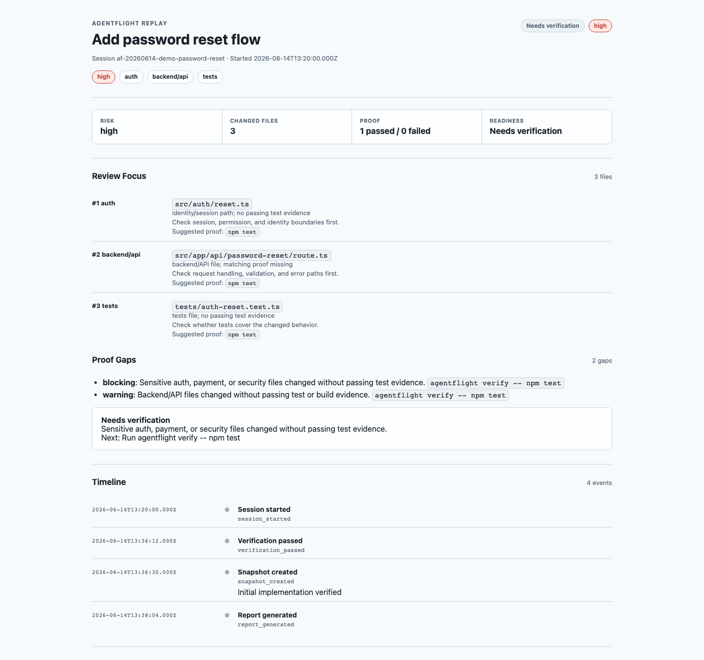

# AgentFlight

<p align="center">
  <a href="https://www.baseframelabs.com/apps/agentflight">
    
  </a>
</p>

See what your coding agent did. Prove it works. Know what to do next.

AgentFlight is a local-first flight recorder for AI coding agents from Baseframe Labs. It sits around Codex, Claude Code, Cursor, Windsurf, Gemini CLI, Aider, OpenCode, and similar tools so you can review the session instead of guessing what happened.

Website: [baseframelabs.com/apps/agentflight](https://www.baseframelabs.com/apps/agentflight)

AgentFlight helps you:

- start an AI coding session
- capture verification evidence
- see changed files and risk
- create snapshots during the session
- generate a proof report
- generate a local replay timeline
- create a resume prompt for the next agent or reviewer



## 60-Second Workflow

```bash
npx agentflight@latest init
npx agentflight@latest start --task "Add password reset flow"

# Run Codex, Claude Code, Cursor, or your coding agent normally

npx agentflight@latest verify -- npm test
npx agentflight@latest snapshot --note "Initial implementation verified"
npx agentflight@latest status
npx agentflight@latest report
npx agentflight@latest replay
npx agentflight@latest resume
```

What you get:

- `init` creates local `.agentflight/` project files.
- `start` records the task, git branch, commit, dirty state, package manager, and tool availability.
- `verify -- npm test` runs the command and stores stdout, stderr, exit code, timing, and pass/fail status.
- `snapshot --note "..."` records the current git, risk, and proof state as a timeline event.
- `status` answers what changed, how risky it is, what proof exists, what proof is missing, and what to do next.
- `report` writes a Markdown proof report for review.
- `replay` writes a local HTML timeline you can open in a browser.
- `resume` writes a Codex/Claude-ready prompt for the next safe step.

## Watch The Flow

AgentFlight turns a loose AI-agent session into a local proof trail:

1. Start a session before you ask the coding agent to work.
2. Capture real verification output with `agentflight verify`.
3. Snapshot meaningful checkpoints.
4. Read `status` to see changed files, risk, proof, gaps, and next action.
5. Generate `report`, `replay`, and `resume` when the work is ready to review or hand off.

The replay artifact is a self-contained local HTML file:



## Why This Exists

AI coding agents move fast. After a few prompts, you can lose track of:

- what changed
- whether the agent drifted from the task
- what was verified
- what failed
- what is safe to review
- how to resume the work later

AgentFlight gives you a local control room for that work. It records the session, captures proof, shows risk, and creates handoff artifacts without uploading source code.

## Sample Outputs

`agentflight status`:

```text
AgentFlight status

Task:
Add password reset flow

Changed files:
3

Risk: medium
- Dependency, backend, or unknown files changed.

Verification Evidence:
1 passed, 0 failed

Latest snapshot:
- Note: Initial implementation verified
- Risk: medium
- Changed files: 3

Review readiness: Ready for review

Next action:
Generate a proof report with agentflight report
```

`agentflight report`:

```text
# AgentFlight Proof Report

## Recommendation
Ready for review

## Verification Evidence
- passed: npm test
- stdout: .agentflight/evidence/.../verification-1.stdout.txt
- stderr: .agentflight/evidence/.../verification-1.stderr.txt
```

`agentflight replay`:

```text
Replay saved:
.agentflight/reports/af-...-replay.html

Timeline:
session_started -> verification_passed -> snapshot_created -> replay_generated
```

`agentflight resume`:

```text
Continue the AgentFlight session for: Add password reset flow

Latest snapshot:
Initial implementation verified

Verification state:
1 passed, 0 failed

Guardrails:
- Stay scoped to the current task.
- Do not claim completion without proof.
- Run relevant verification before declaring success.
```

## Current Capabilities

The current AgentFlight release supports:

- local session setup
- active session tracking
- git branch, commit, dirty state, and changed file detection
- changed file risk categorisation
- verification evidence capture with `agentflight verify`
- session events
- snapshots with `agentflight snapshot --note "..."`
- Markdown proof reports
- self-contained HTML replay timelines
- resume prompts for Codex, Claude Code, or a human reviewer
- doctor checks for local setup
- defensive ProjScan and AgentLoopKit adapters
- no telemetry, cloud sync, or source upload

## What AgentFlight Is Not

AgentFlight is:

- not a coding agent
- not a cloud service
- not a replacement for tests
- not a security scanner
- not a CI platform
- not a code review replacement

Use your coding agent to make changes. Use AgentFlight to understand, verify, replay, and hand off the work.

## How It Works Locally

AgentFlight creates a local `.agentflight/` directory in your repo:

- `config.json` stores local-first project settings.
- `sessions/` stores session metadata.
- `current/` stores the active session, handoff, and resume prompt.
- `reports/` stores Markdown proof reports and HTML replays.
- `evidence/` stores stdout and stderr from captured verification runs.

Sessions store an `events` timeline with meaningful moments such as session start, verification attempts, snapshots, and generated artifacts. Reports include filenames and summaries by default, not full source diffs.

Runtime session data is ignored by git by default in this repo:

- `.agentflight/sessions/`
- `.agentflight/reports/`
- `.agentflight/evidence/`
- `.agentflight/current/`

`.agentflight/config.json` is intentionally not ignored, so a project can commit its local AgentFlight defaults when useful.

## Commands

- `agentflight init` initializes `.agentflight/` with safe writes.
- `agentflight start --task "..."` starts a session and writes the current handoff.
- `agentflight status` summarizes changed files, risk, verification status, snapshots, and next action.
- `agentflight verify -- <command>` runs a proof command and records stdout/stderr evidence.
- `agentflight verify` runs commands from `.agentflight/config.json`.
- `agentflight snapshot --note "..."` records current git, risk, and verification state as a timeline event.
- `agentflight report` generates a Markdown proof report.
- `agentflight replay` generates a local self-contained HTML replay.
- `agentflight resume` prints and saves a continuation prompt.
- `agentflight doctor` checks local setup, scripts, tools, config, and current session state.

Future placeholders exist for `upgrade`, `license`, and `login`; AgentFlight Pro/Team is not available yet.

## Powered By ProjScan And AgentLoopKit

AgentFlight is powered by two open engines from Baseframe Labs:

- ProjScan provides repo intelligence, risk analysis, codebase understanding, and preflight signals.
- AgentLoopKit provides task discipline, verification evidence, policies, and handoffs.

This repository dogfoods both tools. See [docs/development/dogfooding.md](docs/development/dogfooding.md).

Strategic architecture:

- ProjScan: repo intelligence engine
- AgentLoopKit: agent workflow discipline engine
- AgentFlight: commercial and user-facing experience layer

## Example Session

Read [docs/examples/basic-agentflight-session.md](docs/examples/basic-agentflight-session.md) for a short password-reset walkthrough with status, report, replay, and resume artifacts.

## Roadmap

See [docs/roadmap.md](docs/roadmap.md).

Not built yet:

- cloud sync
- login
- billing
- GitHub App
- Team dashboards
- paid feature gates

## Releases

AgentFlight uses npm Trusted Publishing from GitHub Actions for tagged releases. Pushes and pull requests run verification; npm publishes happen from `v*.*.*` tags.

See [docs/development/release.md](docs/development/release.md) and [CHANGELOG.md](CHANGELOG.md).

## Contributing

Use the local verification loop before opening changes:

```bash
npm run verify
```

Keep changes scoped, local-first, and honest about proof. Do not claim tests passed unless they actually ran and passed.

## License

Apache-2.0. See [LICENSE](LICENSE).
